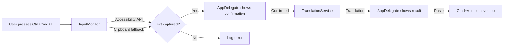

# 🌐 TransPaste

[](https://github.com/mavrovde/TransPaste/actions/workflows/ci.yml)

A lightweight macOS **menu bar app** for **instant in-place translation** with **your choice of AI provider — Google Gemini, OpenAI, Anthropic Claude, local Ollama, or any OpenAI-compatible endpoint**. Select text anywhere, press the global hotkey, confirm — and the translation lands right back where you're working. No window switching, no copy-paste juggling.

---

## ✨ Features

| Feature | Description |
|---|---|
| **Global Hotkey** | `Ctrl + Cmd + T` triggers translation from any application |
| **Multi-Provider AI** | Google Gemini, OpenAI, Anthropic Claude, local Ollama, or any custom OpenAI-compatible endpoint (LM Studio, vLLM, OpenRouter...) — switch from the menu, no restart |
| **No Hardcoded Endpoints** | Provider endpoints and models live in `~/.transpaste/providers.json` (commented, auto-created) — adjust when providers change, no rebuild |
| **Smart Text Capture** | Attempts the Accessibility API first, falls back to a clipboard-based Select All → Copy macro |
| **Confirmation Dialogs** | Shows captured text for review before translating, and the result before pasting |
| **Multi-Language Support** | English, Spanish, French, German, Chinese, Japanese, Russian + Auto-detect |
| **Menu Bar Integration** | Lives in the macOS menu bar — no Dock icon, no main window |
| **Persistent Preferences** | Remembers source/target language and enabled state across launches |
| **File Logging** | All operations logged to `~/translator.log` for debugging |
| **No Xcode Required** | Builds and tests with Command Line Tools only |

---

## 🏗️ Architecture

```
translator/
├── Sources/
│   ├── main.swift                  # App entry point — creates NSApplication
│   ├── AppInfo.swift               # App metadata — single source of the version
│   ├── AppDelegate.swift           # Menu bar UI, language selection, permission prompts
│   ├── InputMonitor.swift          # Carbon hotkey registration, text capture macro
│   ├── TranslationService.swift    # Multi-provider REST client (Gemini, OpenAI, Claude, Ollama, custom)
│   └── Logger.swift                # Thread-safe singleton file logger
├── Tests/
│   ├── TestKit.swift               # Minimal XCTest-free test harness
│   ├── TestMain.swift              # Test runner entry point
│   ├── TranslationServiceTests.swift
│   ├── AppInfoTests.swift
│   ├── InputMonitorTests.swift
│   └── LoggerTests.swift
├── .github/workflows/              # CI (build → test → package), CodeQL, release publishing
├── Info.plist                      # App bundle metadata (LSUIElement = true)
├── Package.swift                   # Swift Package Manager manifest
├── tools/generate_icon.swift       # App icon, generated as code (no binary assets)
├── build.sh                        # Compiles and code-signs the .app bundle
├── package_dmg.sh                  # Builds the drag-to-Applications DMG installer
├── test.sh                         # Compiles and runs the test suite
├── automated_setup.sh              # Guides permission setup via Terminal
└── .env.example                    # Template for API key environment variable
```

### Component Overview



| Component | Responsibility |
|---|---|
| **`AppDelegate`** | Menu bar setup, language settings UI, permission checks, translation dialog flow |
| **`InputMonitor`** | Registers `Ctrl+Cmd+T` via the Carbon `EventHotKey` API, captures text via the Accessibility API or clipboard macro, coordinates paste-back |
| **`TranslationService`** | Builds and sends requests to the selected provider — Gemini `generateContent`, OpenAI Chat Completions, or the Anthropic Messages API (API keys always sent via headers, never in URLs) — and parses each provider's response format |
| **`Logger`** | Thread-safe singleton that appends timestamped messages to `~/translator.log` from any queue |

---

## 📋 Requirements

- **macOS 13 (Ventura)** or later
- **Swift 5.9+** — the Xcode **Command Line Tools are sufficient** (`xcode-select --install`); full Xcode is not required
- **An API key** for at least one provider: [Google Gemini](https://aistudio.google.com/app/apikey), [OpenAI](https://platform.openai.com/api-keys), or [Anthropic Claude](https://console.anthropic.com/settings/keys) — or none: local Ollama and most custom OpenAI-compatible endpoints work key-less
- **Accessibility + Input Monitoring permissions** (the app prompts you on first launch)

---

## 🚀 Getting Started

### Option 1 — Download a Release (easiest)

Grab the latest `TransPaste-<version>.dmg` from the [Releases page](https://github.com/mavrovde/TransPaste/releases), open it, and drag **TransPaste** to **Applications** (a zip is also published if you prefer). The app is ad-hoc signed, so on first launch right-click → **Open** (or `xattr -d com.apple.quarantine /Applications/TransPaste.app`). Then continue at step 4 below for permissions.

### Option 2 — Build from Source

### 1. Clone the Repository

```bash
git clone https://github.com/mavrovde/TransPaste.git
cd TransPaste
```

### 2. Set Up Your API Key

Choose **one** of the following methods:

#### Option A — Environment Variable (recommended for development)

```bash
cp .env.example .env
# Set the key for the provider you use (any one is enough):
export GEMINI_API_KEY=your_key      # Google Gemini (default provider)
export OPENAI_API_KEY=your_key      # OpenAI
export ANTHROPIC_API_KEY=your_key   # Anthropic Claude
```

#### Option B — Paste via the App Menu

After launching the app, open **Provider** in the menu bar dropdown and pick your provider — if it needs an API key you'll be offered to paste one from the clipboard (or open the provider's key page) immediately. Keys are stored separately per provider; providers missing a key are marked right in the menu.

### 3. Build the Application

```bash
./build.sh
```

This will:
1. Generate the app icon (`tools/generate_icon.swift` → `AppIcon.icns`, cached in `build/`)
2. Compile all Swift source files with optimizations (`-O`)
3. Create the app bundle at `build/TransPaste.app`
4. Copy `Info.plist` into the bundle and sync its version from `Sources/AppInfo.swift`
5. Ad-hoc code-sign the bundle for stable identity

### 4. Grant Permissions

The app requires two macOS permissions:

| Permission | Why |
|---|---|
| **Input Monitoring** | To listen for the global `Ctrl+Cmd+T` hotkey |
| **Accessibility** | To read selected text and simulate `Cmd+C` / `Cmd+V` keystrokes |

**Automated setup** (guided Terminal wizard):

```bash
./automated_setup.sh
```

This script resets existing permissions, opens System Settings to the correct pane, reveals the app in Finder for drag-and-drop, and then launches the app once you confirm. TransPaste also detects the Accessibility grant **automatically** — no relaunch needed after toggling it on.

**Manual setup:**

1. Open **System Settings → Privacy & Security → Input Monitoring**
2. Add and enable `TransPaste.app`
3. Open **System Settings → Privacy & Security → Accessibility**
4. Add and enable `TransPaste.app`
5. Launch the app: `open build/TransPaste.app`

### 5. Launch

```bash
open build/TransPaste.app
```

Look for the 💬 speech bubble icon in your menu bar.

---

## 📖 Usage

### Translation Workflow

1. **Select text** in any application (or leave it — the macro will Select All)
2. Press **`Ctrl + Cmd + T`**
3. A dialog appears showing the captured text → click **"Translate"**
4. A second dialog shows the translation → click **"Paste"**
5. The translated text is pasted into the original application ✅

> [!TIP]
> A glass sound 🔔 plays on successful paste. An error sound plays if translation fails.

### Menu Bar Options

| Menu Item | Action |
|---|---|
| **Source: \<language\>** | Choose the input language (or Auto-detect). Default: Russian |
| **Target: \<language\>** | Choose the output language. Default: German |
| **Provider: \<name\>** | Everything provider-related in one submenu: pick a provider (a `— needs API key` suffix marks unready ones; the top-level title shows ⚠ too), then contextual actions for the selected provider — **Paste API Key from Clipboard**, **Get \<Provider\> API Key…**, **Configure Endpoint & Model…** (Custom only), and **Edit providers.json…** (key-less providers get *Open <Provider> Website…* and an *(optional)* key paste instead). Picking a provider without a key offers to paste one or open its key page right away. Default: Gemini |
| **Enable Translation** | Toggle the hotkey on/off (`Ctrl+Cmd+T`) — the menu bar icon dims while disabled |
| **⚠ Finish Setup…** | Appears only while something is missing (permission or provider key) — one click into the guided setup |
| **Setup Assistant…** | Guided check of everything the app needs: re-registers the hotkey, walks through the Accessibility grant (auto-detected, no relaunch) and the provider key, then confirms "All set" |
| **About TransPaste** | Version, author, active provider/model, and config/log paths |
| **Quit** | Exits the application (`Cmd+Q`) |

---

## 🧪 Development

### Running Tests

```bash
./test.sh              # run all tests
./test.sh "API key"    # run only tests whose name matches a filter
```

Tests use a **self-contained harness** (`Tests/TestKit.swift`) instead of XCTest, so they run on machines with only Command Line Tools installed. Coverage includes:

- **`TranslationServiceTests`** — per-provider request construction (headers, endpoints, body shapes), per-provider response parsing (including Claude thinking blocks and refusals), API errors, malformed JSON, missing keys, and end-to-end `translate()` for Gemini, OpenAI, Claude, and Ollama (plus the custom provider) via a mocked `URLSession`
- **`InputMonitorTests`** — initial state, disabled-hotkey guard
- **`LoggerTests`** — singleton identity, file writes, concurrent logging
- **`AppInfoTests`** — semantic version format, metadata coherence, Info.plist ↔ AppInfo version sync

> [!NOTE]
> The hotkey registration and capture macro require real Accessibility/Input Monitoring permissions and a focused target app, so the end-to-end flow is verified manually via the built app.

### Building with Swift Package Manager

While `build.sh` uses `swiftc` directly for simplicity, SPM is also configured:

```bash
swift build              # Debug build
swift build -c release   # Optimized release build
```

SPM builds output a bare executable to `.build/`; only `build.sh` produces the `TransPaste.app` bundle needed for permissions to work.

### Continuous Integration

Every push and pull request to `main` runs the [CI workflow](.github/workflows/ci.yml) with three stages:

1. **Build** — compiles the app bundle and verifies the code signature
2. **Test** — runs the full test suite
3. **Package** — zips `TransPaste.app`, builds the DMG installer, and uploads both as downloadable artifacts (30-day retention)

Pushing a `v*` tag additionally runs the [Release workflow](.github/workflows/release.yml): it verifies the tag matches `AppInfo.version`, re-runs tests and the signed build, and publishes a GitHub release with the DMG installer, the zipped app, SHA-256 checksums, and auto-generated notes.

### Project Configuration

| File | Purpose |
|---|---|
| `Package.swift` | SPM manifest — swift-tools 6.0 (language mode pinned to v5), targets macOS 13+ |
| `Sources/AppInfo.swift` | Single source of the app version — `build.sh` injects it into the bundle's Info.plist |
| `Info.plist` | Bundle ID: `com.mavrovde.transpaste`, `LSUIElement: true` (no Dock icon) |
| `.gitignore` | Ignores `build/`, `.build/`, Xcode artifacts, logs, and `.env` |
| `package_dmg.sh` | Builds the drag-to-Applications `TransPaste-<version>.dmg` (used by CI and releases) |

### API Key Priority

Each provider resolves its API key in this order:

1. **Environment variable** — `GEMINI_API_KEY`, `OPENAI_API_KEY`, or `ANTHROPIC_API_KEY` (plus optional `OLLAMA_API_KEY` / `CUSTOM_LLM_API_KEY` for authed local/custom servers)
2. **UserDefaults** — `GeminiAPIKey`, `OpenAIAPIKey`, `AnthropicAPIKey`, `OllamaAPIKey`, or `CustomAPIKey` (set via the menu bar "Paste API Key" option)

| Provider | Model |
|---|---|
| Google Gemini (default) | `gemini-flash-latest` |
| OpenAI | `gpt-5-mini` |
| Anthropic Claude | `claude-opus-5` (`effort: low` for fast responses) |
| Ollama (local) | `llama3.2` at `http://localhost:11434` — no API key needed |
| Custom | Any OpenAI-compatible endpoint — endpoint URL and model are configurable from the menu; token is optional (local servers usually need none) |

All defaults above live in **`~/.transpaste/providers.json`** — a commented JSON file auto-created on first run. Edit it (endpoint URLs, model names) whenever a provider changes their API; `{model}` in an endpoint is substituted with the configured model. No rebuild needed.

Keys are sent only as request headers (`x-goog-api-key` for Gemini, `Authorization: Bearer` for OpenAI/Ollama/custom, `x-api-key` + `anthropic-version` for Claude), never in URLs (which proxies and servers commonly log).

### Logging

All events are logged to **`~/translator.log`** with ISO 8601 timestamps:

```
[2026-02-17T00:00:00Z] Carbon Hotkey Registered Successfully.
[2026-02-17T00:00:05Z] Carbon Hotkey Detected! Triggering macro...
[2026-02-17T00:00:05Z] Captured Text via AX: Hello world...
[2026-02-17T00:00:06Z] Translation success: Hallo Welt
[2026-02-17T00:00:07Z] Pasted translation.
```

---

## 🔧 Troubleshooting

| Problem | Solution |
|---|---|
| **Hotkey not responding** | Check that Input Monitoring is enabled in System Settings. Try "Setup Assistant…" from the menu. |
| **"Clipboard empty" in logs** | Grant Accessibility permission — the app needs it to simulate `Cmd+C`. |
| **"API Error" or "No API Key"** | Verify the selected provider's API key is set (env var or menu). Check network connectivity. |
| **App not visible** | Look for the speech bubble icon in the menu bar. The app has no Dock icon by design (`LSUIElement: true`). |
| **Translation pastes into wrong app** | Ensure you don't click other windows between confirming and pasting. The app hides itself to restore focus. |
| **Permission prompt not appearing** | Run `./automated_setup.sh` to reset and re-configure permissions. |
| **Permissions lost after updating** | The app was renamed from `on-fly-translator` to `TransPaste` (new bundle ID) — re-grant permissions once via `./automated_setup.sh`. |

### Viewing Logs

```bash
tail -f ~/translator.log
```

---

## 🛡️ Privacy & Security

- **No data collection** — text is sent directly to the selected AI provider's API and not stored anywhere except the local log file.
- **API keys stored locally** — saved per-provider in macOS `UserDefaults` (per-user, not shared) and transmitted only as request headers, never in URLs.
- **Ad-hoc code signing** — the build script signs the bundle with an ad-hoc identity for stable permission grants across rebuilds.
- **No network calls** unless a translation is explicitly triggered by the user.

---

## 📄 License

This project is provided as-is for personal use.

---

## 🤝 Contributing

1. Fork the repository
2. Create a feature branch (`git checkout -b feature/my-improvement`)
3. Make your changes and add tests
4. Run `./test.sh` to verify
5. Commit and push
6. Open a Pull Request
